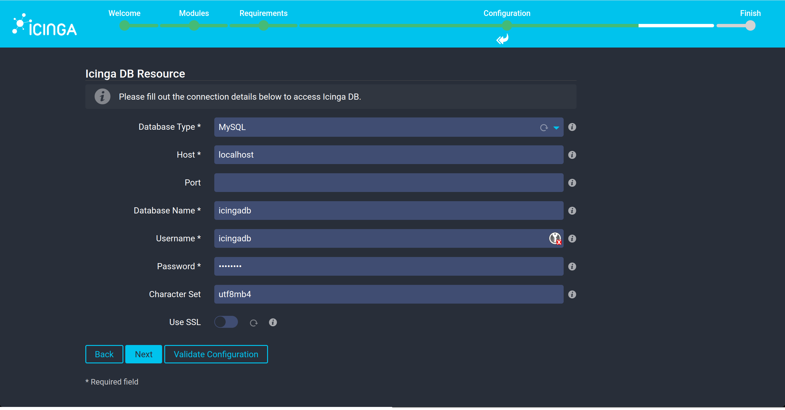
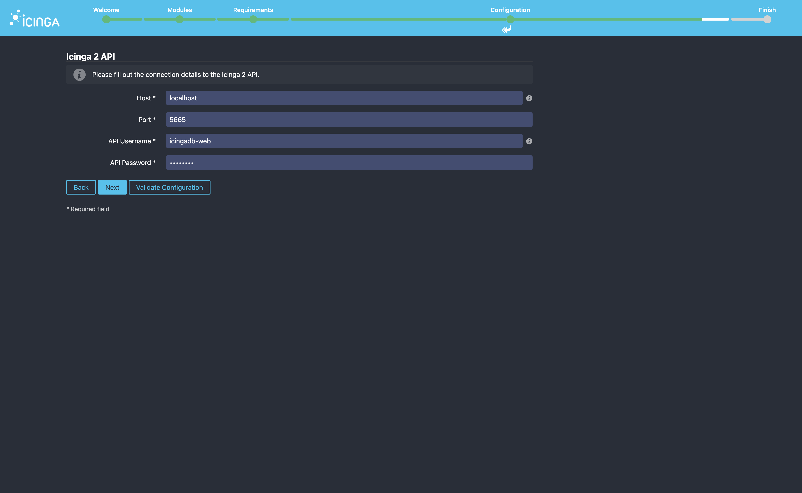
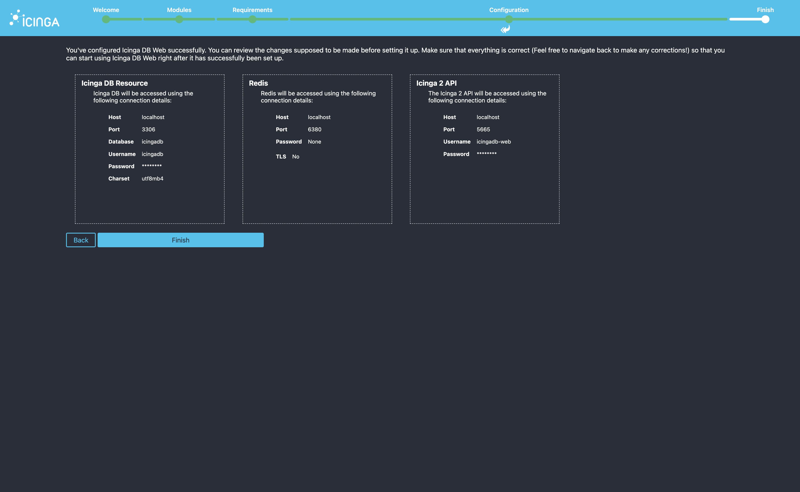
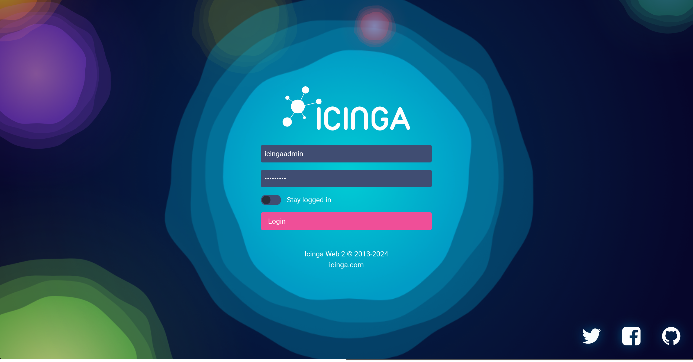

# Icinga Web Setup Walkthrough

This guide will walk you through the initial setup of Icinga Web.


### 1. Welcome

The first page will ask you for the setup token that you created before. This way, only authorized persons can use the setup wizard. Get the token with `icingacli setup token show`.

Add the web server user (`www-data` in case of Apache) to the `icingaweb2`-group to allow the web server to access Icinga Web configuration files:


```bash
usermod -a -G icingaweb2 www-data
systemctl restart apache2
```


### 2. Modules

Next, you can pick the Icinga Web modules to be enabled during the setup. If you followed the quickstart installation guide, Icinga Director is already installed and you can enable it.


### 3. Requirements

Status colors indicate if all requirements are met. The yellow color indicates that an optional dependency is missing.


### 4. Configuration


#### 4.1 Authentication

By choosing the authentication type "Database", Icinga Web users will be stored in MySQL.


#### 4.2 Database Resource

The setup wizard will now ask you for the details of the Icinga Web database which you created before:

- Resource Name: 'icingaweb_db'
- Database Type: 'MySQL'
- Host: 'localhost'
- Database Name: 'icingaweb2'
- Username: 'icingaweb2'
- Password: *YOUR PASSWORD*


#### 4.3 Authentication Backend

Icinga Web supports multiple authentication backends. To identify the backends, each one needs a unique name. We're gonna call this default authentication backend "icingaweb2".


#### 4.4 Aministration

Create a administrative account, this will be your initial user to access Icinga Web:


#### 4.5 Application Configuration

Mutliple configuration parameters are available to adjust the behaviour of logging, debugging and other things. The defaults are just right as for now.


#### 4.6 Check Configurations

The final page summarizes one more time all the configuration which were made.


### 5. Configuration of Icinga DB Web

Next, we configure the Icinga DB Web module. It is resposible for visualizing data that is stored in Icinga DB.


#### 5.1 Icinga DB Resource

The setup wizard will now ask you for the details of the Icinga DB database which you created before:

- Database Type: 'MySQL'
- Host: 'localhost'
- Database Name: 'icingadb'
- Username: 'icingadb'
- Password: *YOUR PASSWORD*



#### 5.2 Redis® for Icinga DB

Since Redis® is running on the same node as Icinga Web, we're setting `localhost` as Redis® Host.


#### 5.3 Icinga 2 API

The credentials of the API-user are stored in `/etc/icinga2/conf.d/api-users.conf`.

- Host: 'localhost'
- Port: '5665'
- API Username: 'root'
- API Password: *PASSWORD FROM FILE*



#### 5.4 Check Configurations

The credentials are verified on the fly. If Icinga Web can access the API, you will see the following page that summarizes the configuration.



One more final page summarizes if the configuration are all valid and working.


Log in to Icinga Web with your administration account.

