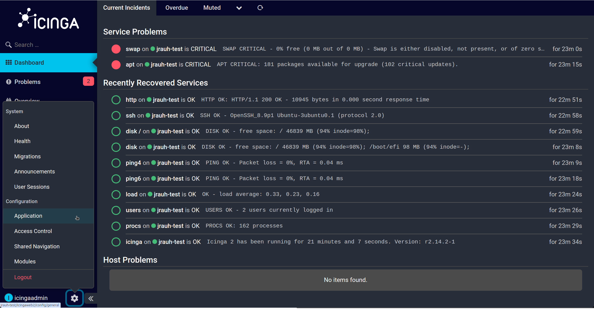
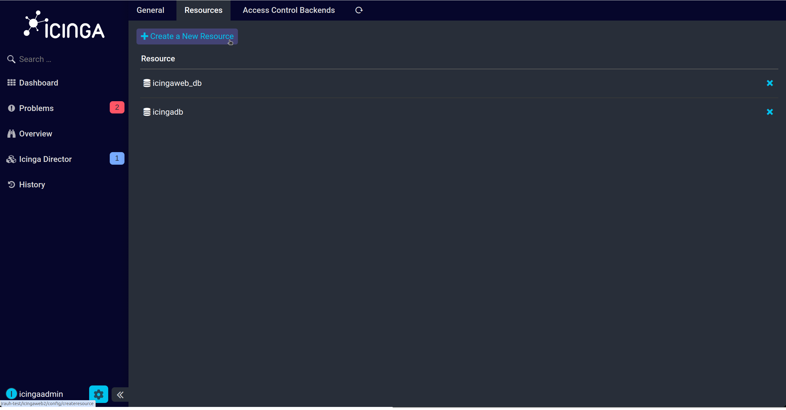
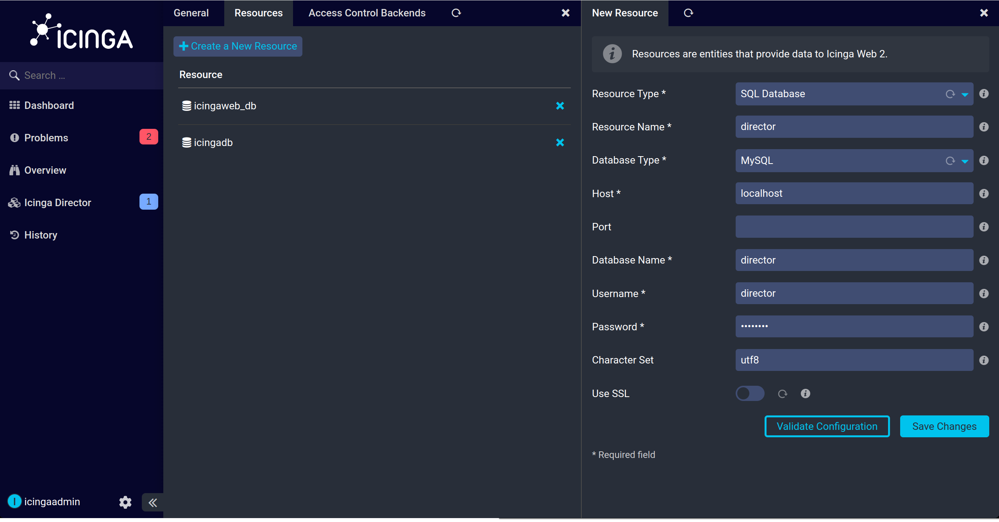
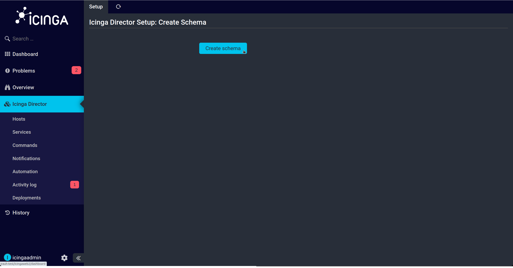
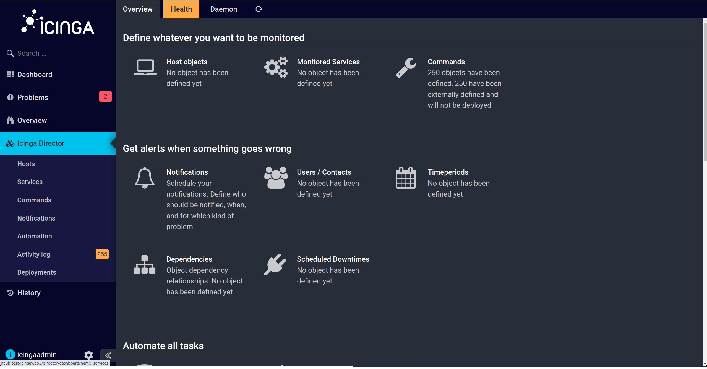
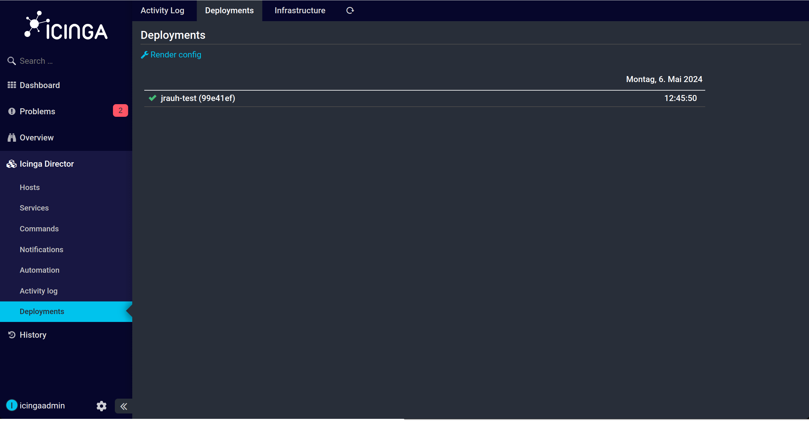

# Director Setup Walktrough

## Configure Icinga Director

Log in to your running Icinga Web setup with a privileged user and follow the steps below to configure the Icinga Director:

Create a new resource for the Icinga Director database via the `Configuration` > `Application` > `Resources`. 

Fill the fields with the credentials of the director database user and continue. Please make sure to configure 'utf8' as encoding.

Select the created database resource.

Create a new schema.

Fill the fields with the hostname of your master and the credentials of your API user.

If the import was successful you get to following page.

Now you have to open `Icinga Director` > `Activity log` and deploy the changes.

If the deployment was successful you get the green check.

