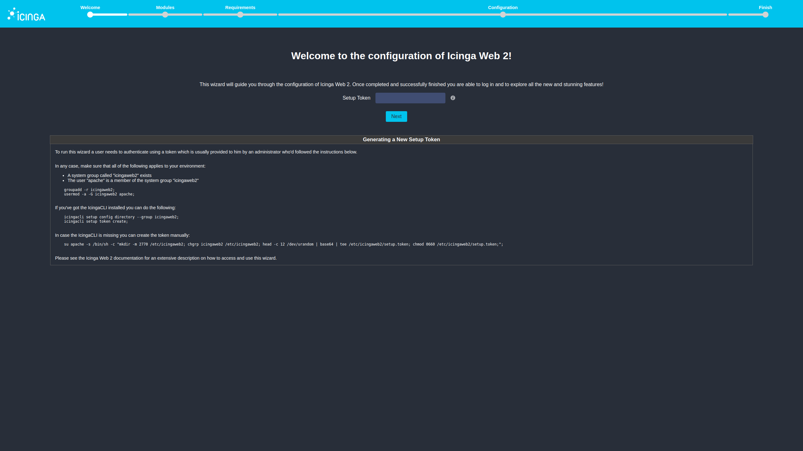
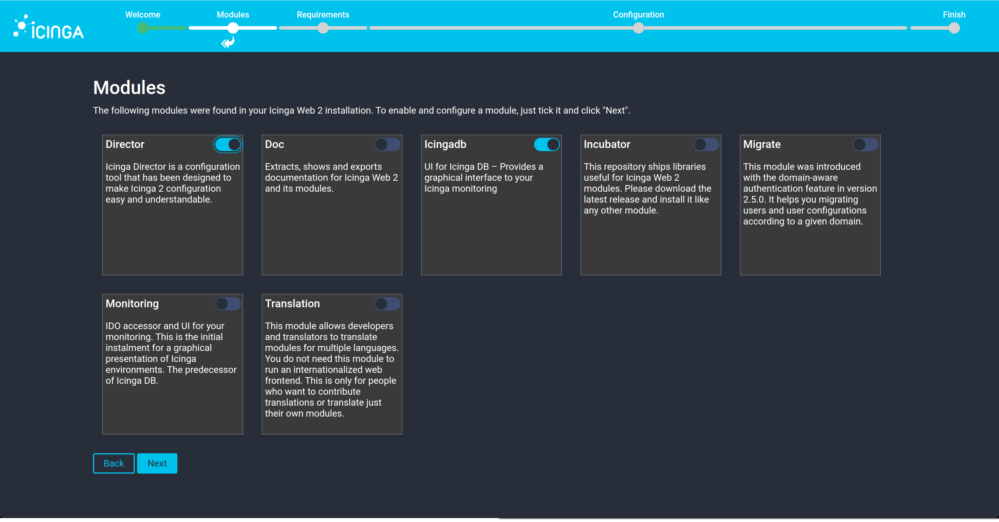
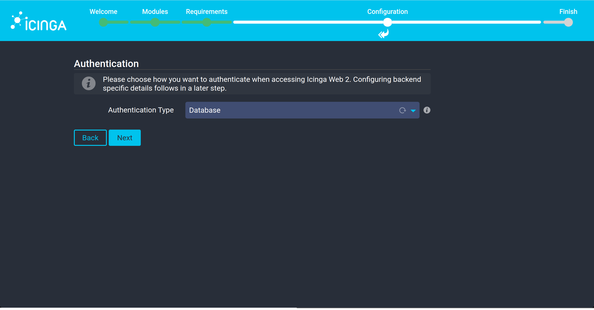
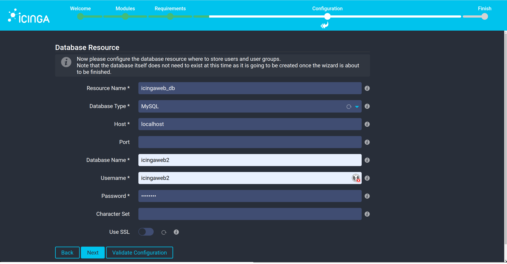
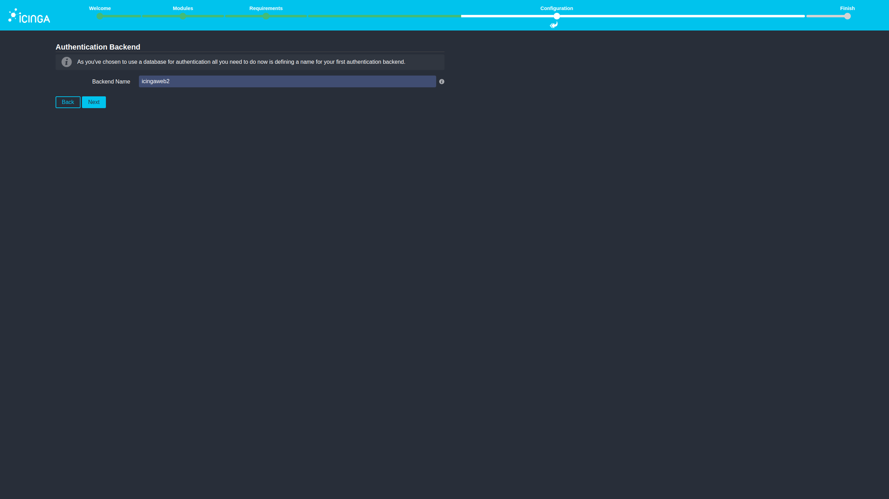
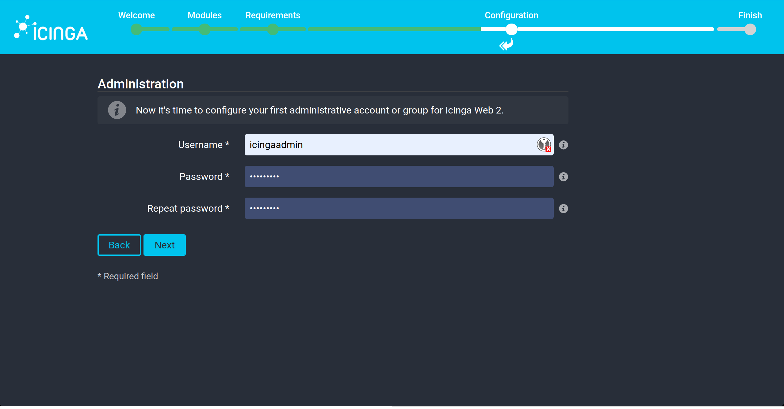
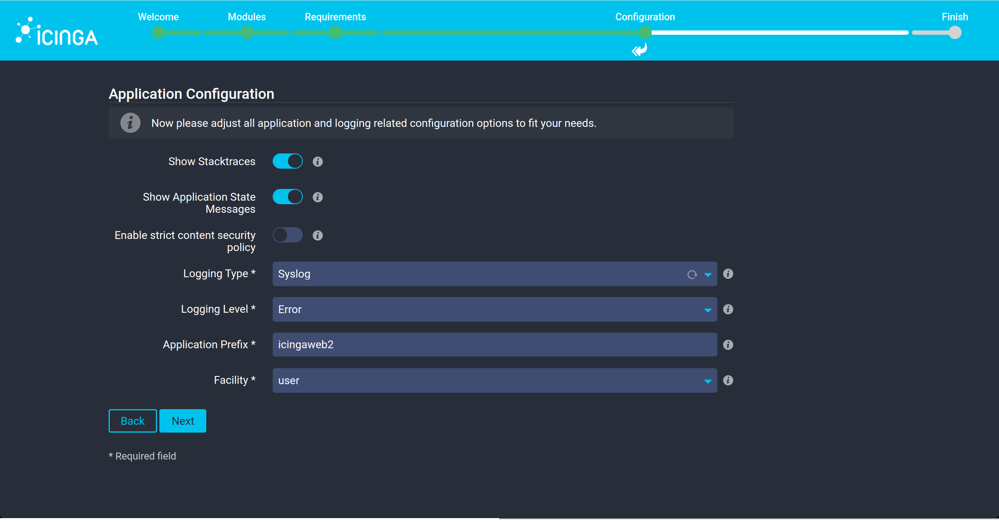
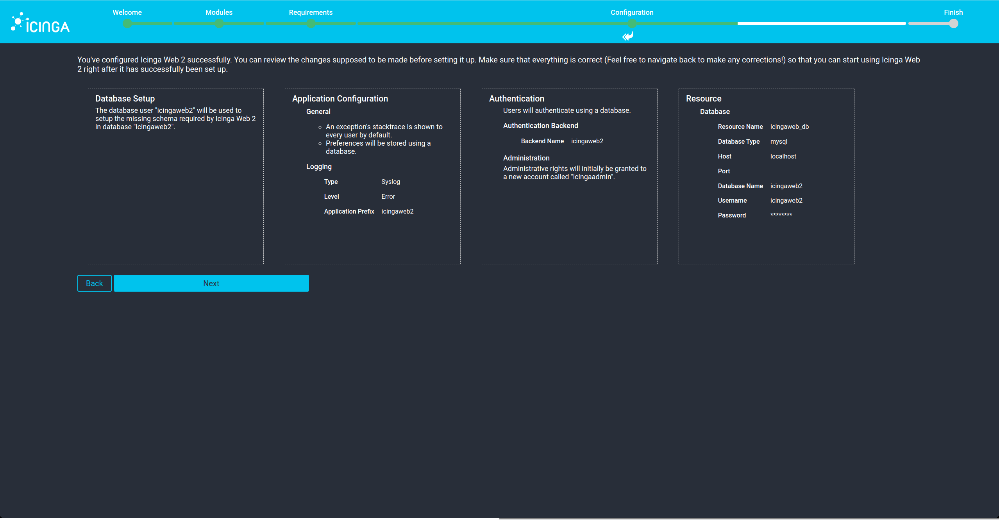
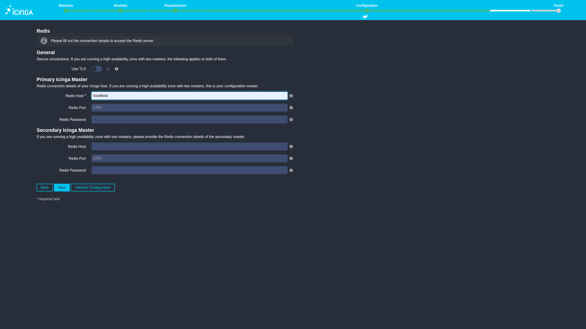
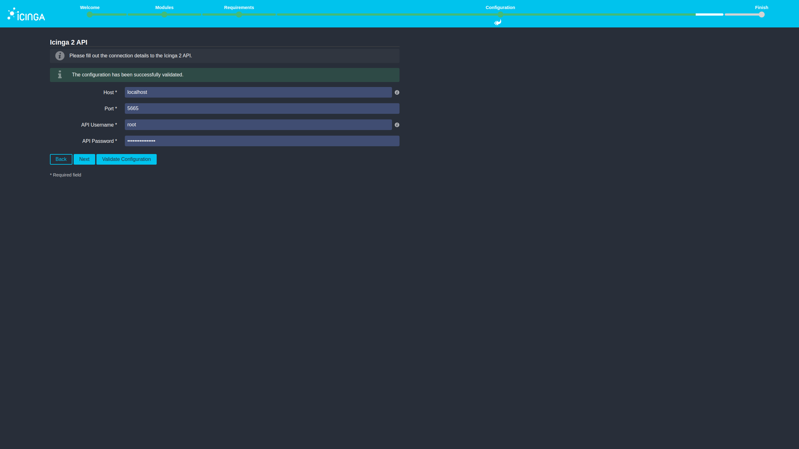

# Web Setup Walktrough
### Steps of Web Setup

**1. Welcome**

Here is the output of the command `icingacli setup token show` requiered.

**2. Modules**

If you already installed the Director you can choose it, no other changes are needed.

**3. Requirements**

There should be all avaible, apart from 'PHP Module: Imagick', but that's expected.

**4. Configuration**

**4.1 Authentication**

Choose the Authentication Type : Database

**4.1 Database Resource**

At this point is the 'icingaweb2' Database requiered:

- Resource Name: icingaweb_db
- Database Type: MySQL
- Host: localhost
- Database Name: icingaweb2
- Username: icingaweb2
- Password: CHANGEME

!!! Info
    The Validation checks just the syntax.

**4.2 Authentication Backend**

- Backend Name: icingaweb2

**4.3 Aministration**

Create a administrative account, this is also your login for icingaweb, f.e. :

- Username: icingaadmin
- Passowrd: icingaweb
- Repeat Passowrd: icingaweb

**4.4 Application Configuration**

The defaults don't need to be change.

**4.5 Check Configurations**

**5. Configuration of Icinga DB Web**

**5.1 Icinga DB Resource**

Here is the Icnga DB Database requiered:

- Database Type: MySQL 
- Host: localhost
- Database Name: icingadb
- Username: icingadb
- Password: CHANGEME

**5.2 Icinga DB Redis**

Set following field of the Primary Icinga Master is
- Redis Host: localhost

**5.3 Icinga 2 API**

The credentials of the API-user are in the file `/etc/icinga2/conf.d/api-users.conf`

- Host: localhost
- Port: 5665
- API Username: root
- API Password: [password in the file]

**5.4 Check Configurations**

